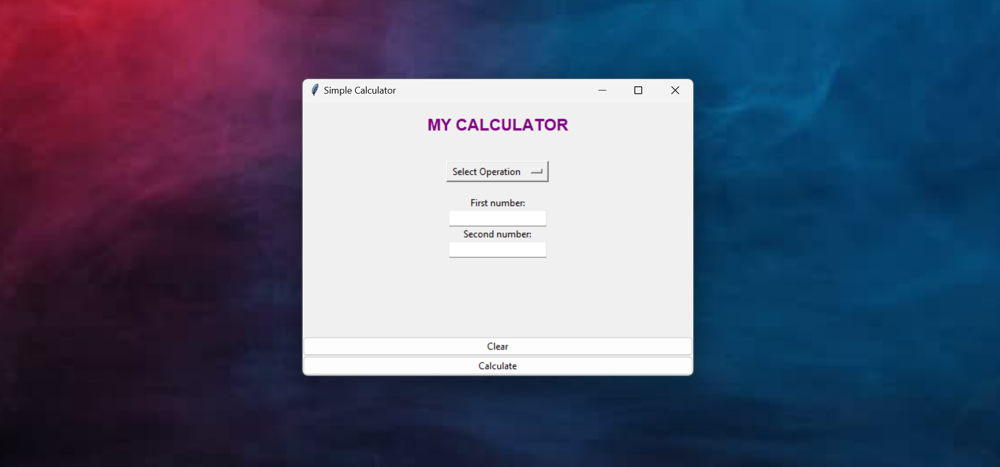
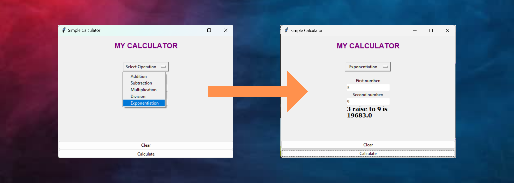

# CALCULATOR CLASS  [NEW FEATURE!! Don't Miss OUT ^_^ ]
This is a simple calculator GUI built using Python's tkinter module. It allows users to perform basic mathematical operations such as addition, subtraction, multiplication and division.
- **THE LATEST UPDATE USED INHERITANCE AS WELL AS MULTIPLE OF IT.**
- Files added are below:
> calculator_extended.py
<br/>
> gui_extended.py

Update: Exponentiation have been Added. (June 4, 2023)

# Getting Started
## Installation
To get started, you'll need to have [Python 3](https://www.python.org/downloads/) installed on your computer. <br/>
>**Note: This program might works only for windows os.**
<br/>

I used [VS Code](https://code.visualstudio.com/download) to create and run the program.

## Dependencies
To install the tkinter module, open up your terminal or command prompt and type:
```pip install tkinter```

## Usage
1. clone or download the project and run the **main.py file**. This will open up the calculator GUI window.
- ```git clone <repository link>```
2. Now, To use the calculator, select the mathematical operation you want to perform from the dropdown menu. 
3. Then enter the first and second numbers in the input fields and click the "Calculate" button. 
4. The result will be displayed in the result label below.
5. You can also clear the inputs and selection by clicking the "Clear" button.

>

#  NEW FEATURE!!!
1. Exponentiation is our latest feature. First number serves as the base while the Second number serves as the exponent!

>

## Test
To run the tests for your calculator-class program on Windows:
1. Open a command prompt or terminal and navigate to the project's root directory.
2. Ensure that pytest is installed. If not, use `pip install pytest` to install it.
3. Run the tests using the command `pytest` in the command prompt or terminal.
That's it! Use pytest to easily run the tests for your calculator-class program on Windows.

# Found a bug?
## Contribute
Pull requests are welcome. For major changes, please open an issue first to discuss what you would like to change.
## Contact Me
If you found a bug, you may contact me >>
[Facebook](https://www.facebook.com/irishcammagay1/)
